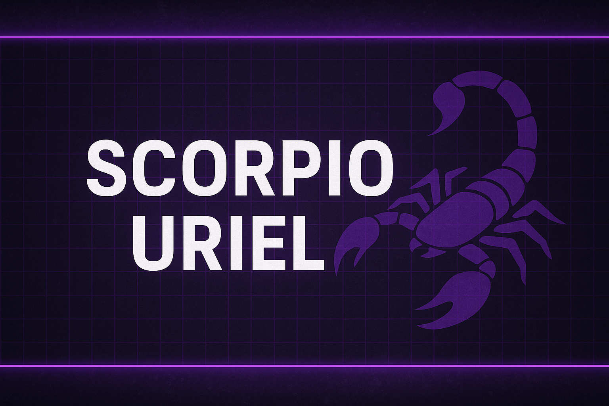

<!-- Banner -->

  

<!-- Typing animation -->

  

<h1 align="center">👋 Hey, I'm Uriel</h1>
<h3 align="center">Fullstack & Mobile Developer | NestJS • React Native • DevOps</h3>

---

## 🚀 About Me

- 🎓 **Software Engineering Graduate** — Master's in Information Systems, Development & AI  
- 🏭 **Apprenticeship at ACC (Automotive Cells Company)** — Industrial Web Supervision (SCADA 2D/3D, Python, SQL)  
- 📱 **Creator of Lambda Project** — Gamified mobile app for goal and habit tracking  
- 🌱 Currently improving my skills in **Figma**, **Advanced NestJS**, **DevOps & CI/CD**  
- 🎯 Mindset: *Build. Break. Improve. Repeat.*

---

## 🛠️ Tech Stack

**Languages**  
`TypeScript` · `JavaScript` · `Python` · `SQL` · `C (Microcontrollers)` · `Bash`

**Frontend & Mobile**  
`React` · `Next.js` · `React Native` · `Expo`

**Backend**  
`NestJS` · `Express` · `REST API` · `GraphQL`

**Data & BI**  
`PostgreSQL` · `MySQL` · `Pandas` · `Power BI` · `ETL Pipelines`

**DevOps & Tools**  
`Docker` · `Git / GitHub` · `GitHub Actions` · `Linux` · `VS Code` · `Figma`

---

## 📌 Featured Projects

| Project | Description | Stack |
|---------|-------------|--------|
| **Lambda App** | Gamified habit & goal-tracking mobile app with XP, rewards, and challenges | React Native · Expo · Zustand |
| **ACC SCADA** | Web-based 2D/3D industrial supervision platform (process, energy, maintenance) | Python · Ignition · SQL |

---

## 📊 GitHub Insights

  
  

  

  

---

## 🐍 Contribution Snake

  <picture>
    <source media="(prefers-color-scheme: dark)" srcset="./dist/github-contribution-grid-snake-dark.svg" />
    
  </picture>

---

## 📬 Contact

📎 **Portfolio** — Coming soon  
💼 **LinkedIn** — https://www.linkedin.com/in/uriel-arthur-millogo-065792228/  
📧 **Email** — uriel.millogo.pro@gmail.com

---

## ⚡ Fun Fact

> 🦂 Scorpio by zodiac… deadliest during code reviews.

---

  © 2025 — Uriel Arthur Millogo • <a href="https://github.com/scorpio-uriel">scorpio-uriel</a>

