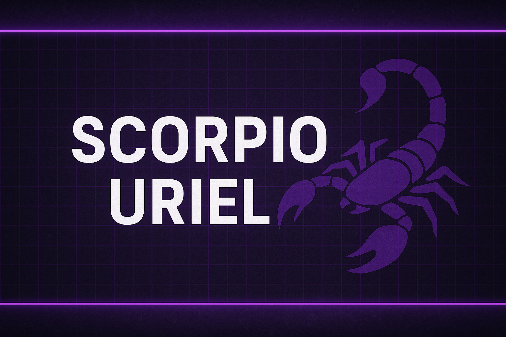

<!-- Banner -->

  

<!-- Typing animation -->

  

<h1 align="center">👋 Hey, I'm Uriel</h1>
<h3 align="center">Full-Stack Engineer · Java & React</h3>

---

## 🚀 About Me

- 🎓 **Engineering graduate from ISEN** — Master's in Information Systems, Development & AI
- 💻 **Full-Stack Developer** specialized in **Java (Spring Boot)** and **React (TypeScript)**
- 🏭 **3 years of work-study (apprenticeship)** at **Automotive Cells Company (ACC)**
- 🤖 Currently building AI-powered enterprise apps (RAG, LLMs, vector search)
- 🎯 Mindset: *Build. Break. Improve. Repeat.*

---

## 🛠️ Tech Stack

**Languages**  
`Java` · `TypeScript` · `JavaScript` · `Python` · `C#`

**Frontend & Mobile**  
`React` · `TypeScript` · `Next.js` · `React Native` · `Expo` 

**Backend**  
`Java` · `Spring Boot` · `Spring AI` · `Node.js` · `REST API` · `SSE`

**Data & BI**  
`PostgreSQL` · `pgvector` · `MySQL` · `MongoDB`

**DevOps**  
`Docker` · `Git / GitHub` · `GitHub Actions` · `CI / CD`

---

## 📌 Featured Projects

### 🧠 [Enterprise RAG Assistant](https://github.com/scorpio-uriel/enterprise-rag-assistant)
A complete enterprise document-AI architecture: ingest internal documents, index them as embeddings in **pgvector**, and answer questions with grounded, sourced responses streamed in real time.

- ⚙️ **Backend** — Spring Boot + Spring AI (RAG pipeline, embeddings, LLM orchestration)
- 🗄️ **Vector store** — PostgreSQL + pgvector
- ⚡ **Streaming** — Server-Sent Events (SSE) for token-by-token answers
- 🎨 **Frontend** — React + TypeScript

`Spring Boot` · `Spring AI` · `pgvector` · `SSE` · `React` · `TypeScript`

---

## 📊 GitHub Insights

  
  

  

---

## 🐍 Contribution Snake

  <picture>
    <source media="(prefers-color-scheme: dark)" srcset="./dist/github-contribution-grid-snake-dark.svg" />
    
  </picture>

---

## 📬 Contact

📎 **Portfolio** — https://scorpio-uriel.github.io/  
💼 **LinkedIn** — https://www.linkedin.com/in/uriel-arthur-millogo-065792228/  
📧 **Email** — uriel.millogo.pro@gmail.com

---

## ⚡ Fun Fact

> 🦂 Scorpio by zodiac… deadliest during code reviews.

---

  © 2025 — Uriel Arthur Millogo • <a href="https://github.com/scorpio-uriel">scorpio-uriel</a>

